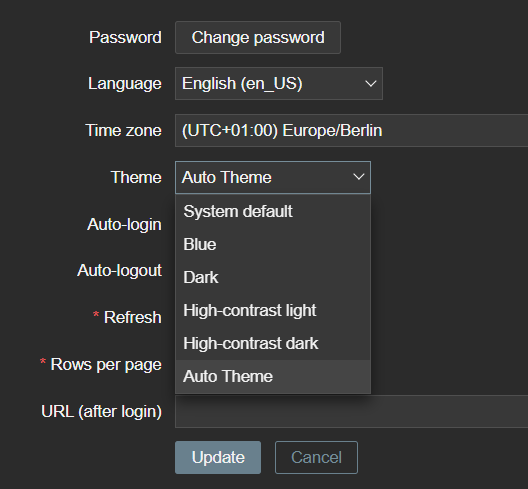

# Simple Custom Theme CSS that loads Dark/Blue Theme based on "prefers-color-scheme" Media Query.

### Installation Instructions

1. Copy `APP.php` to `/usr/share/zabbix/include/classes/core/APP.php`<br>
    This File adds a "Auto Theme" to the Default Theme pool by
    extending the Method `getThemes()` from `ZBase`.<br>
    If you already have a File like this simply add (or extend) your custom
    `class APP extends ZBase` with the following Method
    ```php
    public static function getThemes() {
        return array_merge(parent::getThemes(), [
            /* 'css_file_name_without_extension' => _('theme_name_in_ui') */
                'automatic_dark_mode' => _('Auto Theme')
        ]);
    }
    ```
2. Copy `automatic_dark_mode.css` to `/usr/share/zabbix/assets/style/auto_dark_mode.css`<br>
    This CSS File simply imports either `blue-theme.css` or `dark-theme.css` depending
    on what the media query `prefers-color-scheme` results. (dark/light)
    You can also import alternate `*.css` Files by simply changing `url('<file>')`.

After you restart the Zabbix Frontend, a new Theme called `Auto Theme` should appear.
<p></p>


### Installation Instructions with Docker Compose

1. Create a `Data` or `Provisioning` Folder withing you Compose Project<br>
    The "Source" Files will be placed in this Directory<br>
    Only `APP.php` and `automatic_dark_mode.css` is required
2. Added Read-Only Mounts to your Docker Compose File<br>
    ```yml
    volumes:
        - ./provisioning/zabbix/frontend/APP.php:/usr/share/zabbix/include/classes/core/APP.php:ro
        - ./provisioning/zabbix/frontend/automatic_dark_mode.css:/usr/share/zabbix/assets/styles/automatic_dark_mode.css:ro
    ```
    This will add both Files as Read-Only Mounts

This should be enough, but depending on your Docker Compose Project you might need to<br> complete additonal steps

### Open Tasks:
- Make this Work with Color Schemes from Graphs/Plots. Those are not controlled by CSS but by a PHP Code in `charts<0-7>.php`
